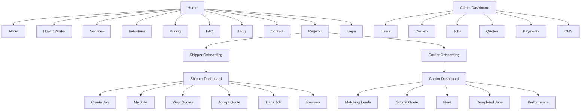

# Information Architecture and Sitemap

## 1. Information Architecture Principles

- Keep the experience simple and confidence-building for first-time users
- Separate public marketing content from authenticated role-based dashboards
- Use progressive disclosure for complex freight workflows
- Ensure every core action is discoverable within 2 clicks from the dashboard

## 2. Core Navigation Structure

### Public Navigation
- Home
- About
- How It Works
- Services
- Industries
- Pricing
- FAQ
- Blog
- Contact
- Register
- Login

### Authenticated Navigation

#### Shipper Dashboard
- Overview
- Create Job
- My Jobs
- Quotes Received
- Accepted Jobs
- Messages
- Notifications
- Invoices
- Reviews
- Settings

#### Carrier Dashboard
- Overview
- Matching Loads
- My Quotes
- Fleet Management
- Vehicle Types
- Won Jobs
- Completed Jobs
- Messages
- Notifications
- Reviews
- Performance
- Settings

#### Admin Dashboard
- Overview
- Users
- Carriers
- Approvals
- Jobs
- Quotes
- Payments
- CMS
- Blog
- Support Tickets
- Analytics

## 3. Sitemap

## 4. Page Inventory

### Marketing Pages

| Page | Route | State |
| --- | --- | --- |
| Home | `/` | Built |
| Contact | `/contact-us` | Built — form has no backend endpoint yet |
| How It Works | `/#how-it-works` | Section on home |
| Why FreightMove | `/#why-freightmove` | Section on home |
| Services / freight types | `/#freight-we-handle` | Section on home |
| Industries | `/#industries` | Section on home |
| Popular routes | `/#popular-routes` | Section on home |
| Customer stories | `/#testimonials` | Section on home |
| FAQ | `/#faq` | Section on home |
| About | — | Not built |
| Pricing | — | Not built |
| Blog | — | Deferred, see below |
| Privacy, Terms | — | Not built; links point at `#faq` as a stopgap |

Until the standalone pages exist, the public nav points at home-page anchors
rather than dead routes. `layout/public-nav.ts` is the single place to change
when a real page lands: swap that item's `fragment` for a `path`.

**Blog / "Learn & Grow" is deferred.** The Resources band is built and
maintained at `features/public/home/sections/resources.ts` but is not rendered
on the home page — see the restore note in `home.ts`. Nav and footer entries for
guides, news and regulations were removed rather than left pointing at a section
that no longer exists.

### Authentication Pages
- Register
- Login
- Forgot Password
- Reset Password

### Dashboard Modules
- Overview, create job, job detail, quote detail, messaging center, notification center, review flow, user settings, admin console

## 5. Content Strategy

- Keep public pages concise and benefit-led
- Use trust signals such as verified carriers, ratings, and real route data
- Use strong CTAs: Book a Load, Post a Freight Job, Become a Carrier

## Freight category pages

Twelve landing pages, one per category in "Freight we handle", each at its own
top-level URL to match the previous site's structure:

`/heavy-haulage` · `/general-freight` · `/container-transport` ·
`/machinery-transport` · `/livestock-transport` · `/boat-transport` ·
`/truck-trailer-transport` · `/grain-hay-transport` · `/bulk-tipper-transport` ·
`/liquid-tanker-transport` · `/portable-building-transport` ·
`/palletised-freight`

Routes, page content and the sitemap are all generated from one list
(`freight-category.data.ts`), so a category cannot exist without a URL, or be
added without becoming discoverable.

### Content is written per category, not templated

Each page carries its own heading, intro, equipment list, pricing factors and
FAQs — naming real trailers, real constraints (NHVR permits, curfews, dangerous
goods classes) and the questions people actually ask about that freight. Twelve
pages built from one set of sentences with the noun swapped is a doorway-page
pattern: search engines treat it as near-duplicate content, and it reads as
filler to the shipper who arrived with a specific question.

### Legacy URLs redirect

The previous site used different slugs for five of these, and they are indexed:

| Old URL | Redirects to |
| --- | --- |
| `/heavy-carriers` | `/heavy-haulage` |
| `/truck-transport` | `/truck-trailer-transport` |
| `/trailer-transport` | `/truck-trailer-transport` |
| `/grain-transport` | `/grain-hay-transport` |
| `/hay-transport` | `/grain-hay-transport` |
| `/portable-buildings-transport` | `/portable-building-transport` |

Redirected **twice on purpose**: Angular handles in-app navigation, and
`web/public/.htaccess` issues a real 301 before any JavaScript runs. The
client-side redirect alone passes ranking signals weakly.

**`/worldwide-transport` is not redirected.** The old site had it; none of the
twelve categories is an equivalent, and pointing it at an unrelated page would
be a soft 404 — worse for visitors and for ranking than letting it go. It needs
a decision: build it as a thirteenth category, or retire it.

### Structured data

Every category page emits one JSON-LD `@graph` containing `Service` (with the
freight it covers as an `OfferCatalog`), `FAQPage` mirroring the visible FAQs,
and `BreadcrumbList`. `sitemap.xml` and `robots.txt` are generated at build time
by `npm run sitemap`, which the build script runs first; signed-in areas are
disallowed in robots.

## Public load board

`/load-board` lists every load currently open for quotes, to anyone, with search
and a freight-type filter. **Looking is open; quoting needs an account.** A
carrier weighing up a subscription should be able to check whether there is
freight on their lanes before paying for anything — sending them to a
registration form to answer that question is the wrong order, so "Find Loads" in
the nav now points here rather than at sign-up.

Shipper identity, budgets and load notes are absent from the API response
entirely rather than hidden in the template, so nothing could leak them even if
the markup were wrong. The page says why in plain words rather than leaving
someone to discover it after signing up.

The home page carries a compact five-row strip of the same board. Each row links
to sign-in, since everything you would actually *do* with a load needs an
account, and a "View all N active loads" link goes to the full board.
