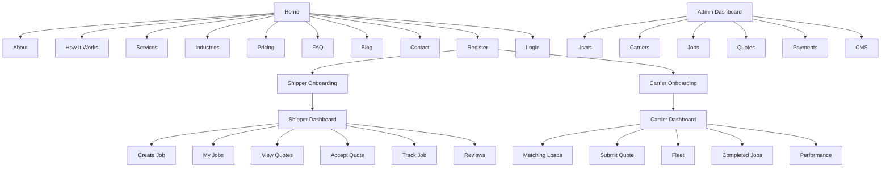

# Information Architecture and Sitemap

## 1. Information Architecture Principles

- Keep the experience simple and confidence-building for first-time users
- Separate public marketing content from authenticated role-based dashboards
- Use progressive disclosure for complex freight workflows
- Ensure every core action is discoverable within 2 clicks from the dashboard

## 2. Core Navigation Structure

### Public Navigation
- Home
- About
- How It Works
- Services
- Industries
- Pricing
- FAQ
- Blog
- Contact
- Register
- Login

### Authenticated Navigation

#### Shipper Dashboard
- Overview
- Create Job
- My Jobs
- Quotes Received
- Accepted Jobs
- Messages
- Notifications
- Invoices
- Reviews
- Settings

#### Carrier Dashboard
- Overview
- Matching Loads
- My Quotes
- Fleet Management
- Vehicle Types
- Won Jobs
- Completed Jobs
- Messages
- Notifications
- Reviews
- Performance
- Settings

#### Admin Dashboard
- Overview
- Users
- Carriers
- Approvals
- Jobs
- Quotes
- Payments
- CMS
- Blog
- Support Tickets
- Analytics

## 3. Sitemap

## 4. Page Inventory

### Marketing Pages
- Home
- About
- How It Works
- Services
- Industries
- Pricing
- FAQ
- Blog
- Contact
- Privacy
- Terms

### Authentication Pages
- Register
- Login
- Forgot Password
- Reset Password

### Dashboard Modules
- Overview, create job, job detail, quote detail, messaging center, notification center, review flow, user settings, admin console

## 5. Content Strategy

- Keep public pages concise and benefit-led
- Use trust signals such as verified carriers, ratings, and real route data
- Use strong CTAs: Book a Load, Post a Freight Job, Become a Carrier
