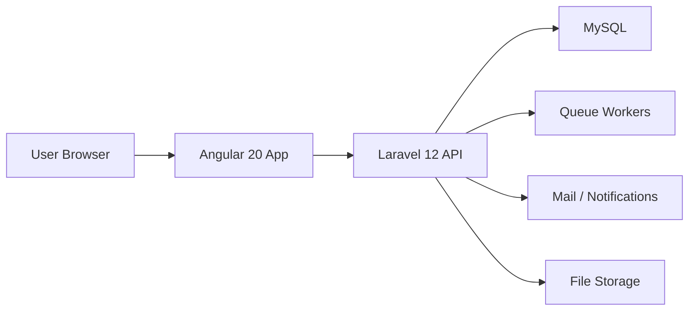

# Architecture and Technical Design

## 1. Overall Architecture

The platform will use a decoupled architecture:
- Angular 20 frontend for all user-facing experiences
- Laravel 12 API backend for business logic, authentication, jobs, messaging, and notifications
- MySQL as the primary relational database
- Queue workers for asynchronous processing
- Static hosting for the Angular app and API hosting for Laravel



## 2. Frontend Architecture

### Stack
- Angular 20
- Standalone components, `ChangeDetectionStrategy.OnPush`
- Angular Signals for local state and computed UI state
- RxJS for async flows and API responses
- SCSS with global design tokens (`src/styles.scss`) and per-component sheets

> Angular Material was originally proposed here and is **not** used. The
> marketing surface needed a bespoke look that fighting Material's opinions
> would have made harder, so the design system is hand-built on tokens and a
> small set of primitives. Nothing depends on Material; adding it later for the
> dashboard remains possible.

### Frontend Structure

Reflects the tree as built.

```text
src/
  app/
    core/                 # cross-cutting, no UI
      auth/               # AuthService, models
      guards/             # auth, guest, role
      http/               # describe-error
      interceptors/       # token attach, 401 handling
      seo/                # Seo service: title, meta, canonical, JSON-LD
    features/
      public/             # home (+ sections/), contact
      auth/               # login, register
      shipper/ carrier/ admin/
    layout/               # PublicLayout, PublicHeader, PublicFooter,
                          # DashboardLayout, public-nav model
    shared/               # Icon + icons registry, Wordmark, SectionHead,
                          # CountUp, Reveal, Ripple, Spotlight, SectionSpy
  environments/
```

Two deliberate departures from the original sketch:

- **`layout/` is top level, not under `core/`.** It holds rendered chrome, and
  `core/` is reserved for things with no UI.
- **`shared/` is flat.** With roughly a dozen primitives, `components/`,
  `directives/` and `pipes/` subfolders added a hop without aiding discovery.

### Shared primitives

| Primitive | Purpose |
| --- | --- |
| `Icon` + `icons.ts` | Inline SVG registry, inherits `currentColor` |
| `SectionHead` | Eyebrow + display heading; `*phrase*` renders in brand red |
| `Reveal` (`fmReveal`) | Scroll reveal; one shared IntersectionObserver for all |
| `CountUp` | Eased number counter, fires on first view |
| `Ripple` (`fmRipple`) | Pointer-origin ripple on primary buttons |
| `Spotlight` (`fmSpotlight`) | Publishes cursor position as `--mx`/`--my` |
| `SectionSpy` | Tracks the in-view section for the active nav indicator |
| `Wordmark` | FreightMove logotype, light and dark tones |

### Frontend Principles
- Lazy-load routes by role and feature area
- `OnPush` change detection on all new components
- Route guards for shipper, carrier, and admin role protection
- Centralize HTTP calls through typed services
- Respect `prefers-reduced-motion` in every animation

### Frontend Principles
- Lazy-load routes by role and feature area
- Use OnPush change detection where appropriate
- Use route guards for shipper, carrier, and admin role protection
- Centralize HTTP calls through typed services
- Keep feature modules small and domain-focused

## 3. Backend Architecture

### Laravel 12 Structure

```text
app/
  Http/
    Controllers/
    Middleware/
    Requests/
  Models/
  Services/
  Repositories/
  Jobs/
  Notifications/
  Events/
  Policies/
  Rules/
  Mail/
  Support/
config/
database/
routes/
storage/
```

### Backend Responsibilities
- Authentication and authorization
- Job lifecycle management
- Quote handling and acceptance
- Notifications and messaging
- File uploads and document verification
- Admin moderation tools

## 4. Authentication Flow

- Users register with role selection
- Sanctum token-based authentication
- Guards protect route access based on role
- Refresh and logout flow handled centrally
- Interceptors can attach tokens and handle 401 responses

## 5. Security Best Practices

- CSRF protection for cookie-based sessions where needed
- Sanitize all uploaded files and documents
- Enforce role-based access control per resource
- Use scoped API tokens and short-lived auth practices
- Enable request validation, throttling, and audit logging
- Avoid exposing sensitive user data in public APIs

## 6. Performance Optimizations

- Angular lazy loading for all dashboard routes
- Image lazy loading and CDN-friendly asset strategies
- Tree shaking and production builds with minification
- Server-side caching for public content and search results where applicable
- Queue-based async tasks to prevent blocking main API requests
- Use optimistic UI for quote actions and message posting where appropriate

## 7. Notification and Messaging Architecture

- Event-driven design for quote received, job accepted, message sent, verification approved
- Queue workers dispatch email, browser, and in-app notifications
- Messaging can be stored in the database and streamed through a future real-time layer

## 8. Deployment Guide

### Frontend
- Build Angular app into static assets
- Deploy to a static host or a public web root configured for SPA serving

### Backend
- Deploy Laravel app to a PHP-compatible hosting environment
- Configure environment variables and queue workers
- Keep storage and uploads in a persistent filesystem or object storage layer

### Hosting Recommendation
- Angular static files on the public web root
- Laravel API under a backend subdomain or subdirectory
- Use separate environment configs for staging and production

## 9. AI-Ready Architecture

The system should be designed so future AI modules can be added without restructuring core domains.

### Planned AI Modules
- AI job creation assistance
- Price prediction
- Carrier recommendation
- Document OCR and verification support
- Smart chatbot support
- Fraud detection heuristics
- Smart notification prioritization
- Route suggestion optimization

### AI Integration Strategy
- Keep AI services behind domain services and queues
- Use event-driven hooks such as job created, quote submitted, and document uploaded
- Store AI outputs as structured metadata rather than embedding logic into UI components
