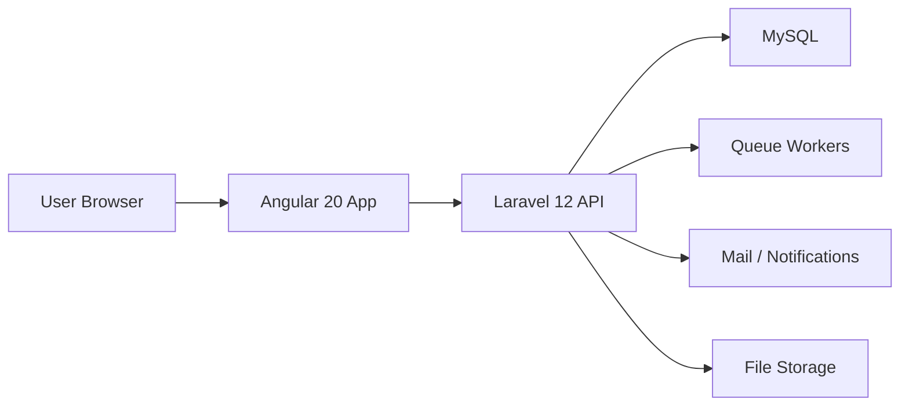

# Architecture and Technical Design

## 1. Overall Architecture

The platform will use a decoupled architecture:
- Angular 20 frontend for all user-facing experiences
- Laravel 12 API backend for business logic, authentication, jobs, messaging, and notifications
- MySQL as the primary relational database
- Queue workers for asynchronous processing
- Static hosting for the Angular app and API hosting for Laravel



## 2. Frontend Architecture

### Stack
- Angular 20
- Standalone components
- Angular Signals for local state and computed UI state
- Angular Material for design system consistency
- RxJS for async flows and API responses
- SCSS modules and theme tokens

### Frontend Structure

```text
src/
  app/
    core/
      auth/
      guards/
      interceptors/
      services/
      layout/
    features/
      public/
      shipper/
      carrier/
      admin/
    shared/
      components/
      directives/
      pipes/
      models/
      ui/
    themes/
    assets/
```

### Frontend Principles
- Lazy-load routes by role and feature area
- Use OnPush change detection where appropriate
- Use route guards for shipper, carrier, and admin role protection
- Centralize HTTP calls through typed services
- Keep feature modules small and domain-focused

## 3. Backend Architecture

### Laravel 12 Structure

```text
app/
  Http/
    Controllers/
    Middleware/
    Requests/
  Models/
  Services/
  Repositories/
  Jobs/
  Notifications/
  Events/
  Policies/
  Rules/
  Mail/
  Support/
config/
database/
routes/
storage/
```

### Backend Responsibilities
- Authentication and authorization
- Job lifecycle management
- Quote handling and acceptance
- Notifications and messaging
- File uploads and document verification
- Admin moderation tools

## 4. Authentication Flow

- Users register with role selection
- Sanctum token-based authentication
- Guards protect route access based on role
- Refresh and logout flow handled centrally
- Interceptors can attach tokens and handle 401 responses

## 5. Security Best Practices

- CSRF protection for cookie-based sessions where needed
- Sanitize all uploaded files and documents
- Enforce role-based access control per resource
- Use scoped API tokens and short-lived auth practices
- Enable request validation, throttling, and audit logging
- Avoid exposing sensitive user data in public APIs

## 6. Performance Optimizations

- Angular lazy loading for all dashboard routes
- Image lazy loading and CDN-friendly asset strategies
- Tree shaking and production builds with minification
- Server-side caching for public content and search results where applicable
- Queue-based async tasks to prevent blocking main API requests
- Use optimistic UI for quote actions and message posting where appropriate

## 7. Notification and Messaging Architecture

- Event-driven design for quote received, job accepted, message sent, verification approved
- Queue workers dispatch email, browser, and in-app notifications
- Messaging can be stored in the database and streamed through a future real-time layer

## 8. Deployment Guide

### Frontend
- Build Angular app into static assets
- Deploy to a static host or a public web root configured for SPA serving

### Backend
- Deploy Laravel app to a PHP-compatible hosting environment
- Configure environment variables and queue workers
- Keep storage and uploads in a persistent filesystem or object storage layer

### Hosting Recommendation
- Angular static files on the public web root
- Laravel API under a backend subdomain or subdirectory
- Use separate environment configs for staging and production

## 9. AI-Ready Architecture

The system should be designed so future AI modules can be added without restructuring core domains.

### Planned AI Modules
- AI job creation assistance
- Price prediction
- Carrier recommendation
- Document OCR and verification support
- Smart chatbot support
- Fraud detection heuristics
- Smart notification prioritization
- Route suggestion optimization

### AI Integration Strategy
- Keep AI services behind domain services and queues
- Use event-driven hooks such as job created, quote submitted, and document uploaded
- Store AI outputs as structured metadata rather than embedding logic into UI components
