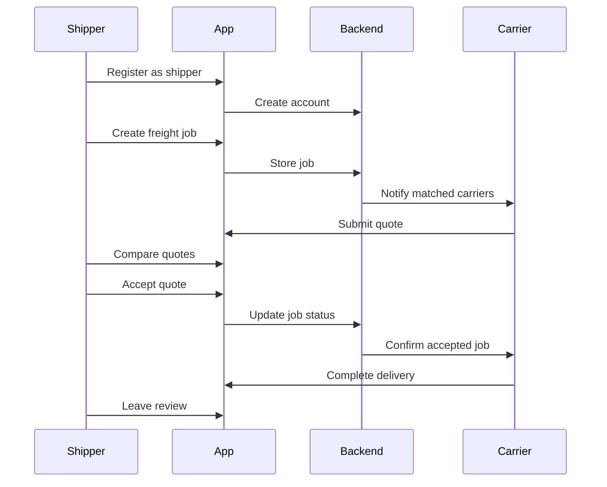
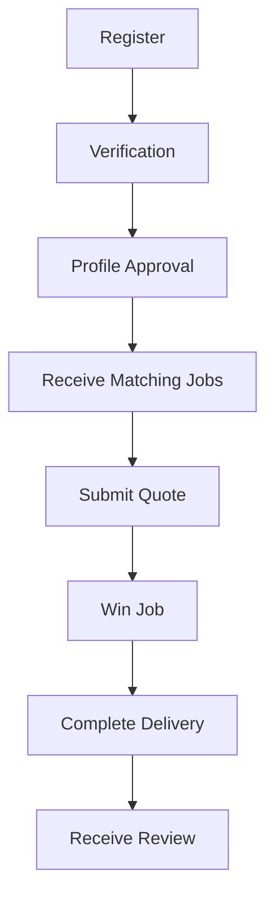
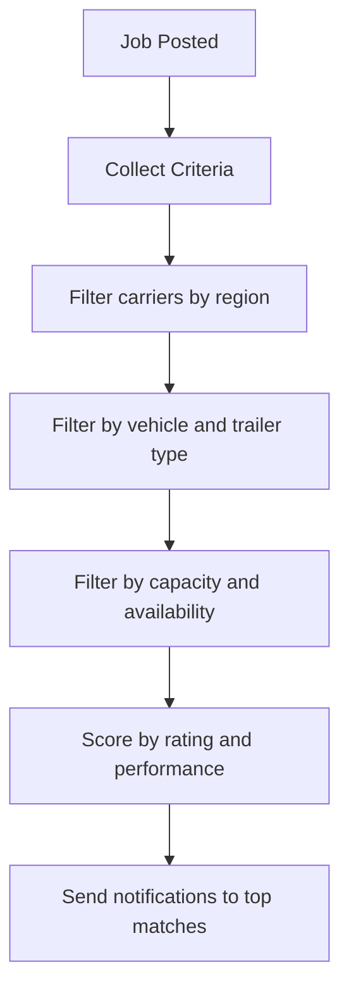
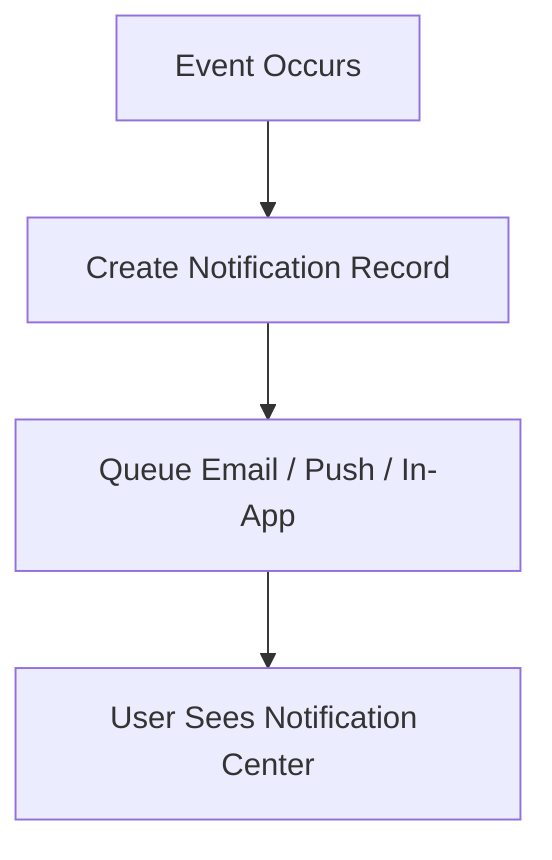
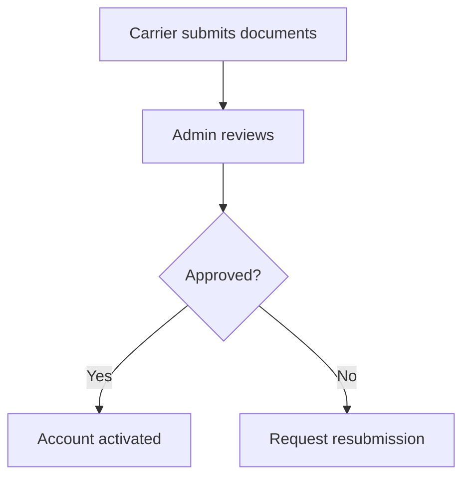

# Workflow and Process Diagrams

## 1. Shipper Workflow

```mermaid
sequenceDiagram
    participant S as Shipper
    participant A as App
    participant B as Backend
    participant C as Carrier

    S->>A: Register as shipper
    A->>B: Create account
    S->>A: Create freight job
    A->>B: Store job
    B->>C: Notify matched carriers
    C->>A: Submit quote
    S->>A: Compare quotes
    S->>A: Accept quote
    A->>B: Update job status
    B->>C: Confirm accepted job
    C->>A: Complete delivery
    S->>A: Leave review
```

## 2. Carrier Workflow

```mermaid
flowchart TD
    A[Register] --> B[Verification]
    B --> C[Profile Approval]
    C --> D[Receive Matching Jobs]
    D --> E[Submit Quote]
    E --> F[Win Job]
    F --> G[Complete Delivery]
    G --> H[Receive Review]
```

## 3. Matching Logic Flow

```mermaid
flowchart TD
    A[Job Posted] --> B[Collect Criteria]
    B --> C[Filter carriers by region]
    C --> D[Filter by vehicle and trailer type]
    D --> E[Filter by capacity and availability]
    E --> F[Score by rating and performance]
    F --> G[Send notifications to top matches]
```

## 4. Notification Flow

```mermaid
flowchart TD
    A[Event Occurs] --> B[Create Notification Record]
    B --> C[Queue Email / Push / In-App]
    C --> D[User Sees Notification Center]
```

## 5. Admin Approval Flow

```mermaid
flowchart TD
    A[Carrier submits documents] --> B[Admin reviews]
    B --> C{Approved?}
    C -->|Yes| D[Account activated]
    C -->|No| E[Request resubmission]
```
