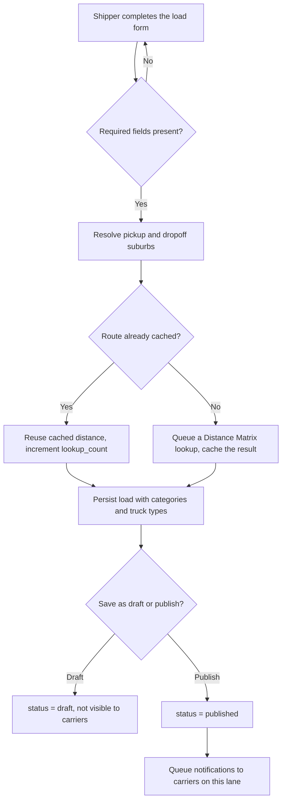
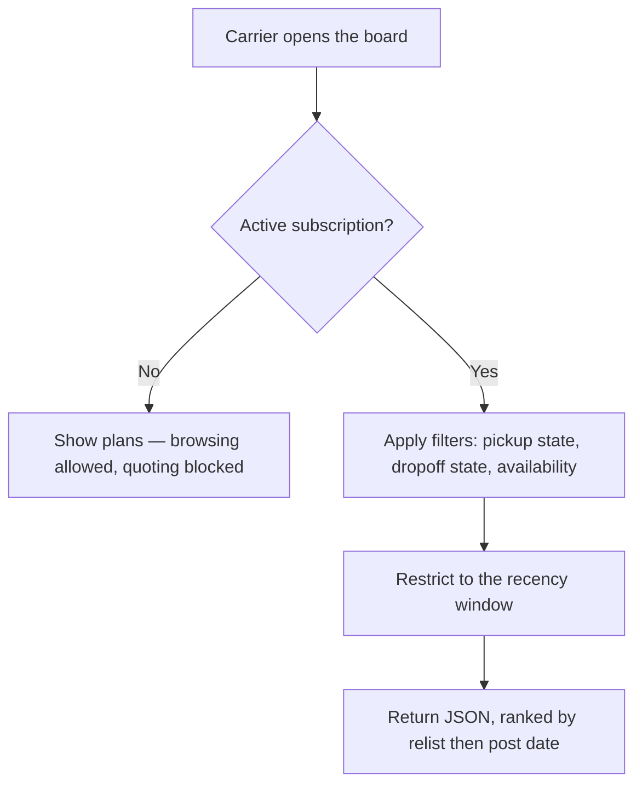
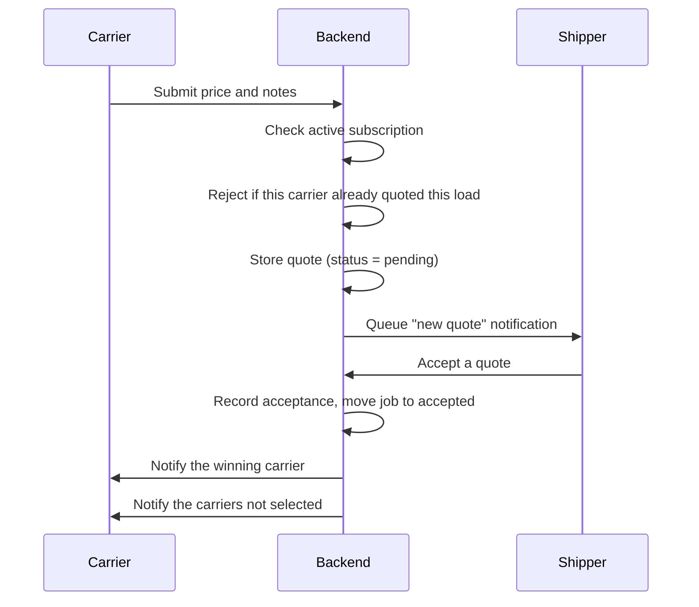
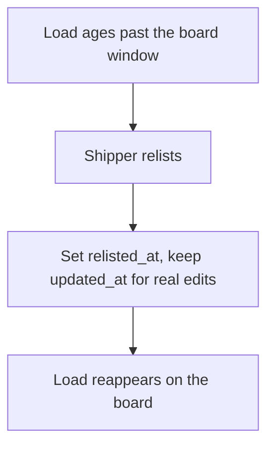
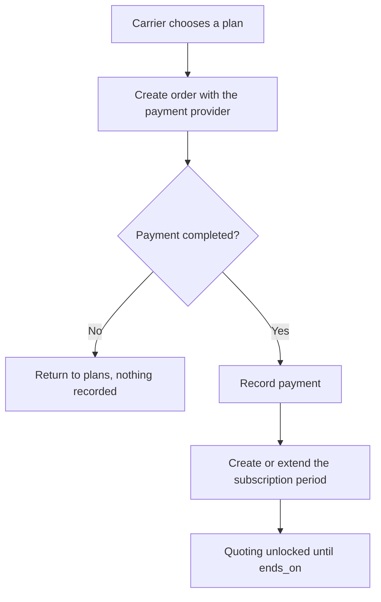
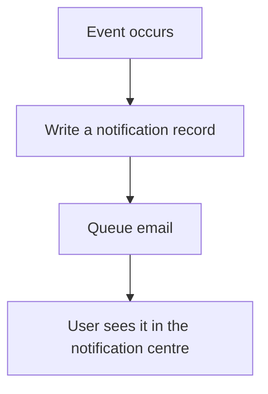
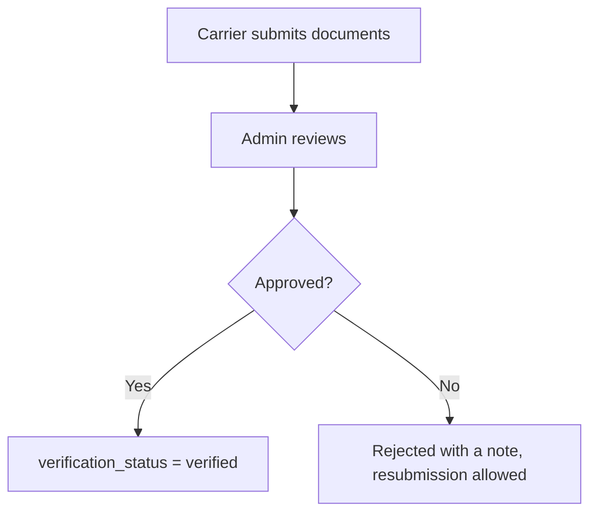

# Workflow and Process Diagrams

Flows reflect the legacy behaviour that must be preserved (see
`docs/10-domain-rules.md`) plus the lifecycle V2 adds. Steps the legacy app did
not have are marked **[new]**; rules carried over are marked **[legacy]**.

## 1. Posting a load

- **[legacy]** The distance cache. Never call the API for a pair already seen.
- **[legacy]** Many categories and many truck types per load.
- **[new]** Draft state. The legacy app inserted immediately with no draft.
- **[new]** The lookup is queued, so posting never blocks on a third-party call.

## 2. Browsing the load board (carrier)

- **[legacy]** Subscription gates the paid capability (**G4**).
- **[legacy]** Filters combine freely — one query with `when()` clauses, never
  a branch per combination.
- **[legacy]** Recency window, previously a hardcoded 7 days; now configurable
  (**G5**).
- **[new]** JSON, not an HTML table fragment assembled in the controller.

## 3. Quoting

- **[legacy]** One quote per carrier per load — in V2 a unique index, not a
  code-only check.
- **[new]** Everything from "Accept a quote" onward. The legacy schema recorded
  no accept or decline state, which is why only 4 of 143 legacy quotes could be
  reconstructed with an outcome.

## 4. Relisting

**[legacy]** behaviour, **[new]** mechanism: the old app bumped `date_updated`,
making an edit indistinguishable from a relist (**G6**).

## 5. Carrier subscription

- **[legacy]** Plans, periods and payment history — all three migrated.
- **[new]** Plans resolve by slug, not the hardcoded record id the legacy
  PayPal controller used, so recreating a plan cannot break checkout.

## 6. Notifications

**[new]** One path. The legacy app sent mail two inconsistent ways — Laravel
Mailables in places, a raw Guzzle POST to SendGrid with HTML built by string
concatenation in others.

## 7. Admin approval

**[new]** The legacy app had no document verification workflow.
